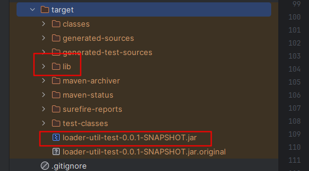

# Dynamic Loader Utility 动态加载器工具包

> 一个用于动态加载和管理Java类的工具库，支持动态编译、AOP代理和Spring Bean管理功能。

[](https://jitpack.io/#com.gitee.wb04307201/dynamic-loader-utility)
[](https://gitee.com/wb04307201/dynamic-loader-utility)
[](https://gitee.com/wb04307201/dynamic-loader-utility)
[](https://github.com/wb04307201/dynamic-loader-utility)
[](https://github.com/wb04307201/dynamic-loader-utility)  
  

## 功能特性

### 1. 动态编译器 (`compiler`包)
- 支持在运行时动态编译Java源代码
- 内存中编译，无需生成.class文件
- 支持自定义编译选项
- 支持加载外部JAR包依赖

主要类：
- [DynamicCompiler](src\main\java\cn\wubo\dynamic\loader\utility\compiler\DynamicCompiler.java#L15-L139): 核心编译器，提供编译和加载功能
- [CompilerOptions](src\main\java\cn\wubo\dynamic\loader\utility\compiler\CompilerOptions.java#L5-L51): 编译选项构建器
- [ByteArrayClassLoader](src\main\java\cn\wubo\dynamic\loader\utility\compiler\ByteArrayClassLoader.java#L7-L51): 字节数组类加载器

### 2. AOP代理 ([aspect](src\main\java\cn\wubo\dynamic\loader\utility\aspect\AspectHandler.java#L11-L11)包)
基于CGLIB实现的面向切面编程支持：
- [IAspect](src\main\java\cn\wubo\dynamic\loader\utility\aspect\IAspect.java#L7-L36): 切面接口，定义前置、后置和异常处理方法
- [SimpleAspect](src\main\java\cn\wubo\dynamic\loader\utility\aspect\SimpleAspect.java#L10-L44): 简单实现，提供方法执行时间统计
- [DynamicAspect](src\main\java\cn\wubo\dynamic\loader\utility\aspect\DynamicAspect.java#L4-L26): 动态代理工厂类
- [AspectHandler](src\main\java\cn\wubo\dynamic\loader\utility\aspect\AspectHandler.java#L8-L42): 方法拦截处理器

### 3. Spring Bean管理 (`bean`包)
提供对Spring容器中Bean的动态注册和注销功能：
- [DynamicBean](src\main\java\cn\wubo\dynamic\loader\utility\bean\DynamicBean.java#L15-L102): 动态Bean管理工具类
- 支持控制器Bean的注册和注销
- 支持请求映射的动态更新

## 快速开始
### 增加 JitPack 仓库
```xml
<repositories>
    <repository>
        <id>jitpack.io</id>
        <url>https://jitpack.io</url>
    </repository>
</repositories>
```
### 引入依赖
```xml
<dependency>
    <groupId>com.gitee.wb04307201</groupId>
    <artifactId>dynamic-loader-utility</artifactId>
    <version>1.2.1</version>
</dependency>
```

## 使用示例

### 动态编译和加载类
```java
String sourceCode = "public class HelloWorld { public void sayHello() { System.out.println(\"Hello, World!\"); } }";
try {
    Class<?> clazz = DynamicCompiler.compileAndLoad(sourceCode);
    Object instance = clazz.newInstance();
    Method method = clazz.getMethod("sayHello");
    method.invoke(instance);
} catch (Exception e) {
    e.printStackTrace();
}
```

### 使用AOP代理
```java
// 创建目标对象
MyService target = new MyService();
// 创建切面
SimpleAspect aspect = new SimpleAspect();
// 创建代理对象
MyService proxy = DynamicAspect.proxy(target, aspect);
// 调用方法，将自动应用切面逻辑
proxy.doSomething();
```


### 动态Bean管理
```java
// 注册Bean
DynamicBean.registerSingleton(beanFactory, "myBean", MyBeanClass.class);
// 注销Bean
DynamicBean.unregisterSingleton(beanFactory, "myBean");
```

## 生产环境进行动态编译
因为本地和服务器的差异导致classpath路径不同，  
进而使服务上动态编译class时会发生找不到import类的异常，  
因此需要对maven编译配置和启动命令做出一定的修改  
### 1. maven编译配置增加如下部分
```xml
            <plugin>
                <groupId>org.apache.maven.plugins</groupId>
                <artifactId>maven-jar-plugin</artifactId>
                <configuration>
                    <archive>
                        <manifest>
                            <!-- 是否要把第三方jar加入到类构建路径 -->
                            <addClasspath>true</addClasspath>
                            <!-- 外部依赖jar包的最终位置 -->
                            <classpathPrefix>lib/</classpathPrefix>
                            <!--指定jar程序入口-->
                            <mainClass>cn.wubo.loaderutiltest.LoaderUtilTestApplication</mainClass>
                        </manifest>
                    </archive>
                </configuration>
            </plugin>
            <plugin>
                <groupId>org.apache.maven.plugins</groupId>
                <artifactId>maven-dependency-plugin</artifactId>
                <executions>
                    <execution>
                        <id>copy-dependencies</id>
                        <phase>package</phase>
                        <goals>
                            <goal>copy-dependencies</goal>
                        </goals>
                        <configuration>
                            <!-- lib依赖包输出目录，打包的时候不打进jar包里 -->
                            <outputDirectory>${project.build.directory}/lib</outputDirectory>
                            <excludeTransitive>false</excludeTransitive>
                            <stripVersion>false</stripVersion>
                            <includeScope>runtime</includeScope>
                        </configuration>
                    </execution>
                </executions>
            </plugin>
```
### 2. 执行编译命令，会在jar包的同级目录下生成lib文件夹存放依赖包

### 3. 将jar包和lib文件夹上到服务器，并在启动命令中增加`-Dloader.path=lib/`
```shell
java -jar -Dloader.path=lib/ loader-util-test-0.0.1-SNAPSHOT.jar
```
